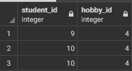
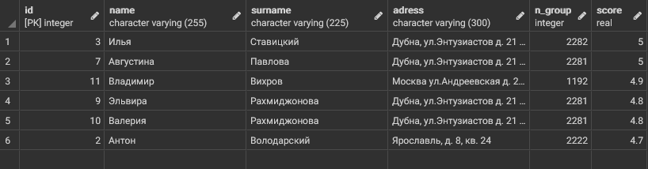
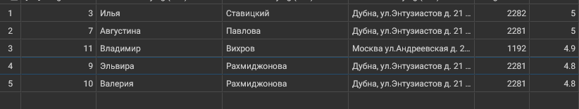
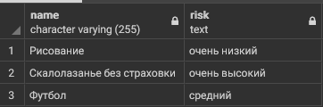
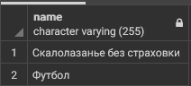
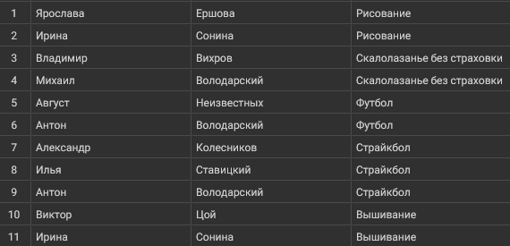
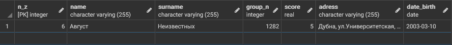

# Таблицы для запросов 
Таблицы, которые будут использованы для запросов:

_Таблица - список студентов_

_Таблица - список хобби_

_Таблица, в которой указаны, чем увлекаются студенты и сколько_

# Однотабличные запросы

## Запрос 1
Вывести всеми возможными способами имена и фамилии студентов, средний балл которых от 4 до 4.5

Результаты запросов одинаковы

Список запросов, которые я нашёл:

1)
~~~sql 
SELECT name, surname FROM student where score >=4.0 AND score <=4.5 
~~~

2)
~~~sql 
SELECT * FROM student as std where std.score >=4.0 AND score <=4.5
~~~
_("as" можно опустить)_

_Результат запросов_

## Запрос 2
Вывести студентов четвертого курса с помощью функции "CAST" (использовать Like)

_Функция "CAST" позволяет преобразовывать атрибуты в другие типы. Как пример:_

~~~sql
CAST(st.score AS varchar)
~~~

_В результате запроса значения в столбце "score" в таблице "st" преобразовываются в "varchar"_

_Предикат Like сравнивает сравнивает текст-образец с имеющимися данными. При совпадении значение предиката равно True. Как пример:_

~~~sql
    SELECT * FROM Ships WHERE class LIKE '%o' ;
~~~

_В результате запроса будет выведена таблица, в которой будут только те строки, в которых значение столбца "class" заканчивается на "о"_

Сам запрос:

~~~sql
select * from student as std where CAST(n_group AS varchar) like '1%'
~~~

_Результат запроса_

## Запрос 3
Вывести всех студентов, отсортировать по убыванию номера группы и имени от А до Я

Для этого используется предложение "order by"

_"Order by" сортирует список по условию, заданному после предложения. К этому предложению можно добавить условия "asc" - по возрастанию (по умолчанию) и "desk" - по убыванию_

Сам запрос:

~~~sql
student as std Order by std.n_group desc, std.name
~~~

_Результат запроса_

## Запрос 4

Вывести студентов, средний балл которых больше 4 и отсортировать по баллу от большего к меньшему

Сам запрос:

~~~sql
select * from student as std Where (std.score >4) Order by std.score desc
~~~

_Результат запроса_

## Запрос 5
Вывести на экран название и риск футбола и хоккея

Сам запрос:

~~~sql
select name,risk from hobby as hb Where hb.name like 'Футбол' or hb.name like 'Хоккей'
~~~

_Результат запроса_

__Примечание: в таблице с хобби отсутствует хоккей, однако данный запрос показывает, как реагирует PostgreSQL на подобные ситуации, а именно продолжает работу как ни в чём не бывало__

## Запрос 6
Вывести id хобби и id студента которые начали заниматься хобби между двумя заданными датами (выбрать самим) и студенты должны до сих пор заниматься хобби

Сам запрос:

~~~sql
select student_id, hobby_id from student_hobby as sh where ((sh.started_at::date > date '2007-01-01') and (sh.finished_at is null))
~~~

_Результат запроса_

## Запрос 7
Вывести студентов, средний балл которых больше 4.5 и отсортировать по баллу от большего к меньшему

Сам запрос:

~~~sql
select * from student as st where (st.score > 4.5) order by st.score desc
~~~

_Результат запроса_

## Запрос 8
Из запроса №7 вывести несколькими способами на экран только 5 студентов с максимальным баллом

_Есть несколько вариантов запросов_

_1)Можно воспользоваться_ 

~~~sql
DESC FETCH FIRST (num) ROWS ONLY
~~~

_Такая структура позволит вывести (num) количество строк_

_2) Можно воспользоваться

~~~sql
LIMIT (num)
~~~

_Что также позволит вывести (num) количество строк_

Сами запросы:

1) 
~~~sql
select * from student as st where (st.score > 4.5) order by st.score desc FETCH FIRST 5 ROWS ONLY
~~~

2)
~~~sql
select * from student as st where (st.score > 4.5) order by st.score desc LIMIT 5
~~~

_Результат запросов (одинаковый для обоих)_

## Запрос 9
Выведите хобби и с использованием условного оператора сделайте риск словами

    >=8 - очень высокий
    >=6 & <8 - высокий
    >=4 & <8 - средний
    >=2 & <4 - низкий
    <2 - очень низкий

_Для этого запроса используется CASE...END, который позволяет сравнить значения по нескольким условиям_

Сам запрос:

~~~sql
select hobby.name,
CASE
WHEN hobby.risk >=8 then 'очень высокий'
WHEN hobby.risk >=6 and hobby.risk <8 then 'высокий'
WHEN hobby.risk >=4 and hobby.risk <8 then 'средний'
WHEN hobby.risk >=2 and hobby.risk <4 then 'низкий'
Else 'очень низкий'
end risk
from hobby
~~~

_Результат запроса_

## Запрос 10
Вывести 3 хобби с максимальным риском

Сам запрос:

~~~sql
select name from hobby as hb order by hb.risk desc Limit 2
~~~

__Примечание: Я в запросе указал 2 хобби, а не 3, так как у меня всего 3 запроса. Для чистоты эксперимента будут показаны 2 хобби, у которых наибольший риск среди 3__

_Результат запроса_

# Многотабличные запросы

## Запрос 1
Вывести все имена и фамилии студентов, и название хобби, которым занимается этот студент.

Сам запрос:

~~~sql
select st.name, st.surname, hb.name 
from hobby as hb, student as st, student_hobby as sh 
where
	sh.student_id = st.id and
	sh.hobby_id = hb.id and
	(finished_at is null)
~~~

_Результат запроса_

## Запрос 2
Вывести информацию о студенте, занимающимся хобби самое продолжительное время.

Сам запрос:

~~~sql
select * from student as st
where st.id in
	(select student_id started_at from student_hobby as sh
	  where (sh.finished_at is null )
	 order by (started_at::date) limit 1)
~~~

_Результат запроса_

## Запрос 3

Сам запрос:

~~~sql

~~~

_Результат запроса_

## Запрос 1

Сам запрос:

~~~sql

~~~

_Результат запроса_