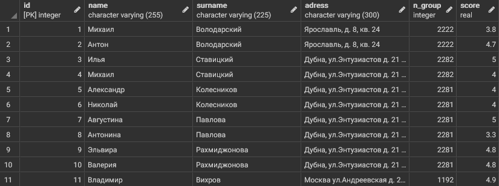
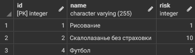
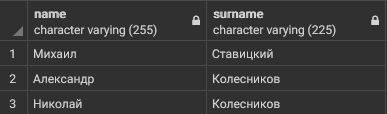
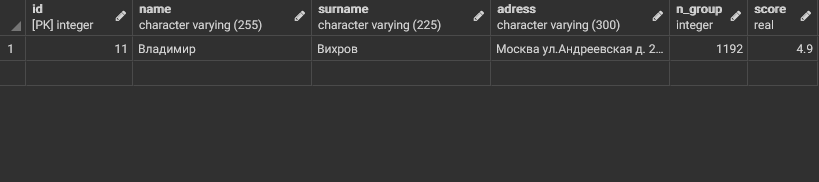
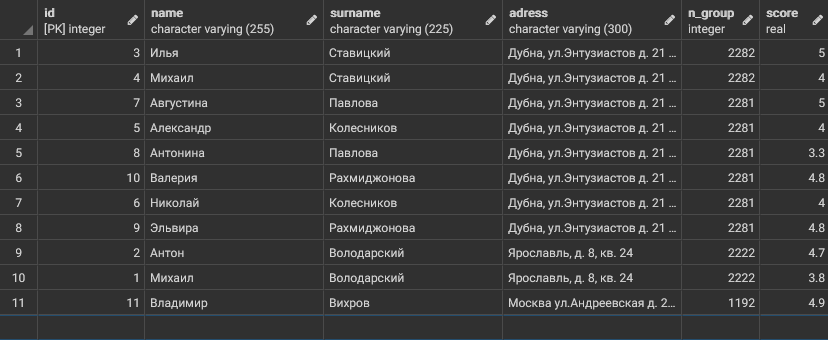
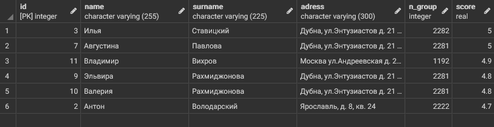
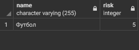

# Таблицы для запросов 
Таблицы, которые будут использованы для запросов:

_Таблица - список студентов_

_Таблица - список хобби_

_Таблица, в которой указаны, чем увлекаются студенты и сколько_

# Запросы

## Запрос 1
Вывести всеми возможными способами имена и фамилии студентов, средний балл которых от 4 до 4.5

Результаты запросов одинаковы

Список запросов, которые я нашёл:

1)
~~~sql 
SELECT name, surname FROM student where score >=4.0 AND score <=4.5 
~~~

2)
~~~sql 
SELECT * FROM student as std where std.score >=4.0 AND score <=4.5
~~~
_("as" можно опустить)_

_Результат запросов_

## Запрос 2
Вывести студентов четвертого курса с помощью функции "CAST" (использовать Like)

_Функция "CAST" позволяет преобразовывать атрибуты в другие типы. Как пример:_

~~~sql
CAST(st.score AS varchar)
~~~

_В результате запроса значения в столбце "score" в таблице "st" преобразовываются в "varchar"_

_Предикат Like сравнивает сравнивает текст-образец с имеющимися данными. При совпадении значение предиката равно True. Как пример:_

~~~sql
    SELECT * FROM Ships WHERE class LIKE '%o' ;
~~~

_В результате запроса будет выведена таблица, в которой будут только те строки, в которых значение столбца "class" заканчивается на "о"_

Сам запрос:

~~~sql
select * from student as std where CAST(n_group AS varchar) like '1%'
~~~

_Результат запроса_

## Запрос 3
Вывести всех студентов, отсортировать по убыванию номера группы и имени от А до Я

Для этого используется предложение "order by"

_"Order by" сортирует список по условию, заданному после предложения. К этому предложению можно добавить условия "asc" - по возрастанию (по умолчанию) и "desk" - по убыванию_

Сам запрос:

~~~sql
student as std Order by std.n_group desc, std.name
~~~

_Результат запроса_

## Запрос 4

Вывести студентов, средний балл которых больше 4 и отсортировать по баллу от большего к меньшему

Сам запрос:

~~~sql
select * from student as std Where (std.score >4) Order by std.score desc
~~~

_Результат запроса_

## Запрос 5
Вывести на экран название и риск футбола и хоккея

Сам запрос:

~~~sql
select name,risk from hobby as hb Where hb.name like 'Футбол' or hb.name like 'Хоккей'
~~~

_Результат запроса_

__Примечание: в таблице с хобби отсутствует хоккей, однако данный запрос показывает, как реагирует PostgreSQL на подобные ситуации, а именно продолжает работу как ни в чём не бывало__

## Запрос 6
Вывести id хобби и id студента которые начали заниматься хобби между двумя заданными датами (выбрать самим) и студенты должны до сих пор заниматься хобби

~~~sql

~~~