# Таблицы для запросов 
Таблицы, которые будут использованы для запросов:

_Таблица - список студентов_

_Таблица - список хобби_

_Таблица, в которой указаны, чем увлекаются студенты и сколько_

# Однотабличные запросы

## Запрос 1
Вывести всеми возможными способами имена и фамилии студентов, средний балл которых от 4 до 4.5

Результаты запросов одинаковы

Список запросов, которые я нашёл:

1)
~~~sql 
SELECT name, surname FROM student where score >=4.0 AND score <=4.5 
~~~

2)
~~~sql 
SELECT * FROM student as std where std.score >=4.0 AND score <=4.5
~~~
_("as" можно опустить)_

_Результат запросов_

## Запрос 2
Вывести студентов четвертого курса с помощью функции "CAST" (использовать Like)

_Функция "CAST" позволяет преобразовывать атрибуты в другие типы. Как пример:_

~~~sql
CAST(st.score AS varchar)
~~~

_В результате запроса значения в столбце "score" в таблице "st" преобразовываются в "varchar"_

_Предикат Like сравнивает сравнивает текст-образец с имеющимися данными. При совпадении значение предиката равно True. Как пример:_

~~~sql
    SELECT * FROM Ships WHERE class LIKE '%o' ;
~~~

_В результате запроса будет выведена таблица, в которой будут только те строки, в которых значение столбца "class" заканчивается на "о"_

Сам запрос:

~~~sql
select * from student as std where CAST(n_group AS varchar) like '1%'
~~~

_Результат запроса_

## Запрос 3
Вывести всех студентов, отсортировать по убыванию номера группы и имени от А до Я

Для этого используется предложение "order by"

_"Order by" сортирует список по условию, заданному после предложения. К этому предложению можно добавить условия "asc" - по возрастанию (по умолчанию) и "desk" - по убыванию_

Сам запрос:

~~~sql
student as std Order by std.n_group desc, std.name
~~~

_Результат запроса_

## Запрос 4

Вывести студентов, средний балл которых больше 4 и отсортировать по баллу от большего к меньшему

Сам запрос:

~~~sql
select * from student as std Where (std.score >4) Order by std.score desc
~~~

_Результат запроса_

## Запрос 5
Вывести на экран название и риск футбола и хоккея

Сам запрос:

~~~sql
select name,risk from hobby as hb Where hb.name like 'Футбол' or hb.name like 'Хоккей'
~~~

_Результат запроса_

__Примечание: в таблице с хобби отсутствует хоккей, однако данный запрос показывает, как реагирует PostgreSQL на подобные ситуации, а именно продолжает работу как ни в чём не бывало__

## Запрос 6
Вывести id хобби и id студента которые начали заниматься хобби между двумя заданными датами (выбрать самим) и студенты должны до сих пор заниматься хобби

Сам запрос:

~~~sql
select student_id, hobby_id from student_hobby as sh 
where ((sh.started_at::date > date '2007-01-01') and (sh.finished_at is null))
~~~

_Результат запроса_

## Запрос 7
Вывести студентов, средний балл которых больше 4.5 и отсортировать по баллу от большего к меньшему

Сам запрос:

~~~sql
select * from student as st where (st.score > 4.5) order by st.score desc
~~~

_Результат запроса_

## Запрос 8
Из запроса №7 вывести несколькими способами на экран только 5 студентов с максимальным баллом

_Есть несколько вариантов запросов_

_1)Можно воспользоваться_ 

~~~sql
DESC FETCH FIRST (num) ROWS ONLY
~~~

_Такая структура позволит вывести (num) количество строк_

_2) Можно воспользоваться

~~~sql
LIMIT (num)
~~~

_Что также позволит вывести (num) количество строк_

Сами запросы:

1) 
~~~sql
select * from student as st where (st.score > 4.5) order by st.score desc FETCH FIRST 5 ROWS ONLY
~~~

2)
~~~sql
select * from student as st where (st.score > 4.5) order by st.score desc LIMIT 5
~~~

_Результат запросов (одинаковый для обоих)_

## Запрос 9
Выведите хобби и с использованием условного оператора сделайте риск словами

    >=8 - очень высокий
    >=6 & <8 - высокий
    >=4 & <8 - средний
    >=2 & <4 - низкий
    <2 - очень низкий

_Для этого запроса используется CASE...END, который позволяет сравнить значения по нескольким условиям_

Сам запрос:

~~~sql
select hobby.name,
CASE
WHEN hobby.risk >=8 then 'очень высокий'
WHEN hobby.risk >=6 and hobby.risk <8 then 'высокий'
WHEN hobby.risk >=4 and hobby.risk <8 then 'средний'
WHEN hobby.risk >=2 and hobby.risk <4 then 'низкий'
Else 'очень низкий'
end risk
from hobby
~~~

_Результат запроса_

## Запрос 10
Вывести 3 хобби с максимальным риском

Сам запрос:

~~~sql
select name from hobby as hb order by hb.risk desc Limit 2
~~~

__Примечание: Я в запросе указал 2 хобби, а не 3, так как у меня всего 3 запроса. Для чистоты эксперимента будут показаны 2 хобби, у которых наибольший риск среди 3__

_Результат запроса_

# Многотабличные запросы

### Таблицы для запросов 
Таблицы, которые будут использованы для запросов:

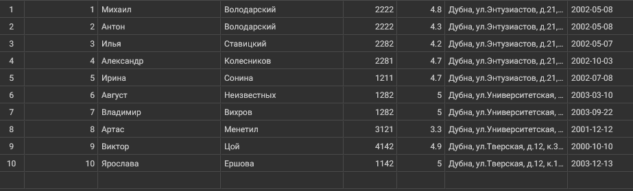

_Таблица - список студентов_

_Таблица - список хобби_

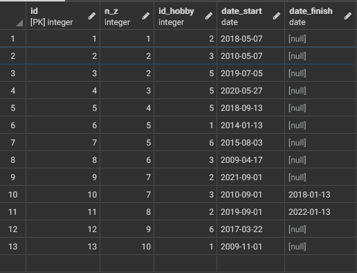

_Таблица, в которой указаны, чем увлекаются студенты и сколько_

## Запрос 1
Вывести все имена и фамилии студентов, и название хобби, которым занимается этот студент.

Сам запрос:

~~~sql
select st.name, st.surname, hb.name 
from hobby as hb, students as st, stud_hobby as sh 
where
	sh.n_z = st.n_z and
	sh.id_hobby = hb.id and
	(date_finish is null)
~~~

_Результат запроса_

## Запрос 2
Вывести информацию о студенте, занимающимся хобби самое продолжительное время.

Сам запрос:

~~~sql
select * from students as st
where st.n_z in
	(select n_z, date_start from stud_hobby as sh
	  where (sh.date_finish is null )
	 order by (date_start::date) limit 1)
~~~

_Результат запроса_

## Запрос 3
Вывести имя, фамилию, номер зачетки и дату рождения для студентов, средний балл которых выше среднего, а сумма риска всех хобби, которыми он занимается в данный момент, больше 0.9.

Сам запрос:

~~~sql
SELECT st.name, st.surname, st. n_z, st.date_birth
FROM students as st LEFT JOIN (
SELECT n_z, SUM(risk)
FROM stud_hobby as sh
JOIN hobby h on sh.id_hobby = h.id
GROUP BY  n_z) as nt 
ON st. n_z=nt.n_z
WHERE st.score>= (select AVG(score) FROM students) and nt.sum>9
~~~

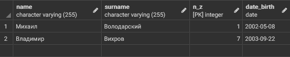

_Результат запроса_

## Запрос 4
Вывести фамилию, имя, зачетку, дату рождения, название хобби и длительность в месяцах, для всех завершенных хобби Диапазон дат.

Сам запрос:

~~~sql
SELECT st.surname, st.name, st.n_z, st.date_birth, h.name, sth.do_time FROM students st 
INNER JOIN 
  (SELECT sth.n_z, sth.id_hobby,
    ((sth.date_finish - sth.date_start)/30) as do_time 
  FROM stud_hobby sth 
  WHERE sth.date_finish - sth.date_start IS NOT NULL) sth 
ON st.n_z = sth.n_z 
INNER JOIN hobby h
ON sth.id_hobby = h.id
~~~

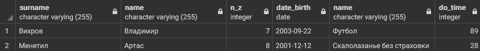

_Результат запроса_

## Запрос 5
Вывести фамилию, имя, зачетку, дату рождения студентов, которым исполнилось N полных лет на текущую дату, и которые имеют более 1 действующего хобби.

Сам запрос:

~~~sql
SELECT st.surname, st.name, st.n_z, st.date_birth
FROM students as st 
Inner JOIN(
	SELECT n_z, 
		(count(sh.date_start)-count(sh.date_finish)) as yrs
	FROM stud_hobby as sh
	JOIN hobby as h on sh.id_hobby = h.id
	GROUP BY n_z) as nt 
ON st.n_z= nt.n_z
WHERE extract(year from age(st.date_birth)) > 19 and nt.yrs>1
~~~

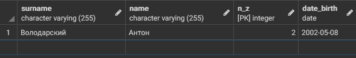

_Результат запроса_

## Запрос 6
Найти средний балл в каждой группе, учитывая только баллы студентов, которые имеют хотя бы одно действующее хобби.

Сам запрос:

~~~sql
SELECT st.group_n, round(AVG(st.score)::decimal, 2)
FROM students as st 
INNER JOIN stud_hobby as sh
on st.n_z = sh.n_z
WHERE (sh.date_finish IS NULL)
GROUP BY group_n
~~~

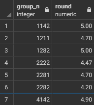

_Результат запроса_

## Запрос 7
Найти название, риск, длительность в месяцах самого продолжительного хобби из действующих, указав номер зачетки студента.

Сам запрос:

~~~sql
SELECT st.n_z, h.name, h.risk, round((extract(days from (NOW()-sth.date_start))/30)::decimal ,2)
FROM students as st
INNER JOIN stud_hobby as sth
	ON st.n_z = sth.n_z
INNER JOIN hobby as h 
	ON h.id = sth.id_hobby
WHERE ((sth.date_finish IS NULL) and (st.n_z=5))
ORDER BY sth.date_start
Limit 1
~~~

_Результат запроса_

## Запрос 8
Найти все хобби, которыми увлекаются студенты, имеющие максимальный балл.

Сам запрос:

~~~sql
SELECT h.name as hobby
FROM hobby h
INNER JOIN
	stud_hobby as sh 
on h.id=sh.id_hobby
INNER JOIN(
	SELECT st.n_z
	FROM students as st
	WHERE (st.score=(select MAX(score) from students))) as nt 
on nt.n_z = sh.n_z
WHERE (sh.date_finish IS NULL)
~~~

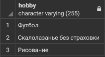

_Результат запроса_

## Запрос 9
Найти все действующие хобби, которыми увлекаются троечники 2-го курса.

Сам запрос:

~~~sql
SELECT h.name as hobby
FROM hobby h
INNER JOIN stud_hobby as sh 
on h.id = sh.id_hobby
INNER JOIN (
	SELECT st.n_z
	FROM students st
	WHERE ABS(st.score-4)<0.5 and group_n/1000=2) as st 
on st.n_z = sh.n_z
WHERE date_finish IS NULL
~~~

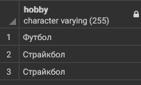

_Результат запроса_

## Запрос 10
Найти номера курсов, на которых более 50% студентов имеют более одного действующего хобби.

Сам запрос:

~~~sql
SELECT course_active.course
FROM
(SELECT course, COUNT(DISTINCT sh.n_z )as zanim
FROM stud_hobby sh
INNER JOIN (
	SELECT DISTINCT group_n/1000 as course, st.n_z
	FROM students st) as nt on nt.n_z = sh.n_z
	WHERE date_finish IS NULL
	GROUP BY course) as course_active
RIGHT JOIN
(SELECT group_n/1000 as course, COUNT(*) from students st GROUP BY group_n/1000) as course_all 
on course_active.course = course_all.course
WHERE course_active.zanim*1./course_all.count>0.5
~~~

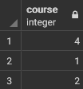

_Результат запроса_

## Запрос 11
Вывести номера групп, в которых не менее 60% студентов имеют балл не ниже 4.

Сам запрос:

~~~sql
SELECT st.group_n
FROM students as st
GROUP BY st.group_n
HAVING 1.* COUNT(
	CASE
    	WHEN st.score>=4 THEN 1
    ELSE NULL
END)/COUNT(*)>=0.6
~~~

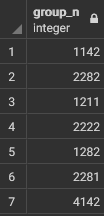

_Результат запроса_

## Запрос 12
Для каждого курса подсчитать количество различных действующих хобби на курсе.

Сам запрос:

~~~sql
SELECT group_n/1000 as course, COUNT(distinct h.name)
FROM students as st
RIGHT JOIN stud_hobby as sh 
on sh.n_z=st.n_z
Left JOIN hobby as h 
on h.id=sh.id_hobby
GROUP BY group_n/1000
~~~

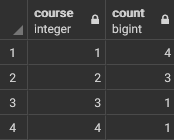

_Результат запроса_

## Запрос 13
Вывести номер зачётки, фамилию и имя, дату рождения и номер курса для всех отличников, не имеющих хобби. Отсортировать данные по возрастанию в пределах курса по убыванию даты рождения.

Сам запрос:

~~~sql
SELECT st.n_z, st.surname, st.name, date_birth, group_n/1000 as course
FROM students as st
LEFT JOIN stud_hobby as sh 
on sh.n_z=st.n_z
Left JOIN hobby as h on 
h.id=sh.id_hobby
WHERE sh.id_hobby is NULL and score=5
ORDER BY course, date_birth DESC
~~~

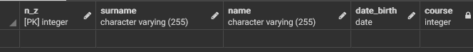

_Результат запроса_

__Примечание: B моих таблицах нет отличников, не имеющих хобби. Как и студентов без хобби впринципе__

## Запрос 14
Создать представление, в котором отображается вся информация о студентах, которые продолжают заниматься хобби в данный момент и занимаются им как минимум 5 лет.

__Примечание: Представление - это запрос, который предполагается использовать часто, поэтому он вынесен отдельно с помощью View, сохранён в базе данных, и пользователь может обращаться к нему как к обычной таблице__

Сам запрос:

~~~sql
CREATE OR REPLACE VIEW Zapros14 AS
SELECT st.n_z, st.name, st.surname, st.adress, st.score, st.group_n, st.date_birth
FROM students as st 
RIGHT JOIN stud_hobby as sh 
on st.n_z = sh.n_z
WHERE date_finish is null and extract(years from (clock_timestamp ( )- date_start))>5
~~~

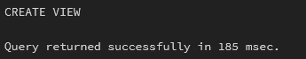

__Примечание: Представления сохраняются в отдельном разделе__

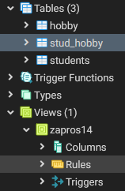

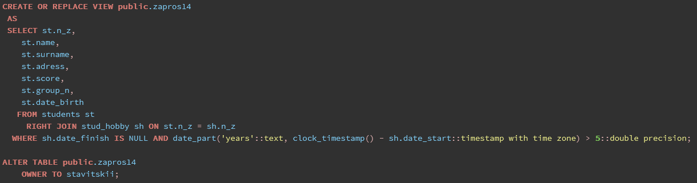

_Результат запроса_

## Запрос 15
Для каждого хобби вывести количество людей, которые им занимаются.

Сам запрос:

~~~sql
SELECT h.name, COUNT(distinct (sh.n_z, sh.id_hobby)) as count 
FROM hobby h 
LEFT JOIN stud_hobby as sh
on h.id=sh.id_hobby
WHERE sh.date_finish is null
GROUP BY h.name
~~~

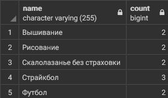

_Результат запроса_

## Запрос 16
Вывести ИД самого популярного хобби.

Сам запрос:

~~~sql
SELECT id FROM(
	SELECT h.id, COUNT(distinct (sh.n_z, sh.id_hobby)) as count 
	FROM hobby as h 
	LEFT JOIN stud_hobby as sh 
	on h.id=sh.id_hobby
	WHERE date_finish is null
	GROUP BY h.id
	ORDER BY count desc limit 1)
as foo
~~~

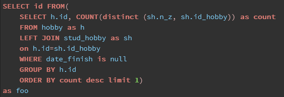

__Примечание: As foo мне подсказал генератор замен для запросов в самом PostgreSQL__

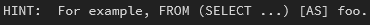

_Результат запроса_

__Примечание: В связи с ограниченностью временных рамок, а именно мне перед дэдлайном времени на все запросы уже банально не хватало, я пропустил 17 запрос__

## Запрос 18
Вывести ИД 3х хобби с максимальным риском.

Сам запрос:

~~~sql
SELECT id FROM hobby ORDER BY risk desc limit 3
~~~

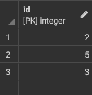

_Результат запроса_

## Запрос 19
Вывести 10 студентов, которые занимаются одним (или несколькими) хобби самое продолжительно время.

Сам запрос:

~~~sql
SELECT distinct * FROM
students st 
RIGHT JOIN stud_hobby sh 
on st.n_z = sh.n_z
WHERE date_finish is null
ORDER BY date_start  limit 10
~~~

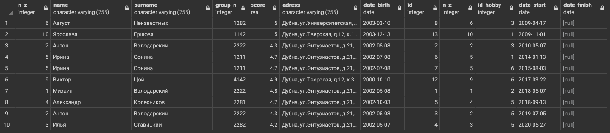

_Результат запроса_

## Запрос 20
Вывести номера групп (без повторений), в которых учатся студенты из предыдущего запроса.

Сам запрос:

~~~sql
SELECT distinct group_n FROM
	(SELECT distinct * FROM
	students st 
	RIGHT JOIN stud_hobby sh 
	on st.n_z = sh.n_z
	WHERE date_finish is null
	ORDER BY date_start  limit 10)
as foo
~~~

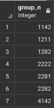

_Результат запроса_

## Запрос 21
Создать представление, которое выводит номер зачетки, имя и фамилию студентов, отсортированных по убыванию среднего балла.

Сам запрос:

~~~sql
CREATE OR REPLACE VIEW zapros21 AS
SELECT n_z, name, surname
FROM students
ORDER BY score desc
~~~

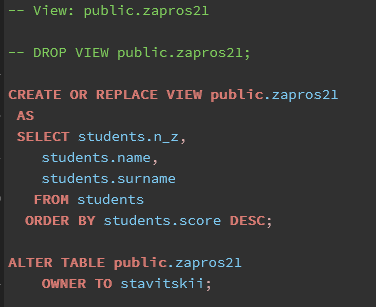

_Результат запроса_