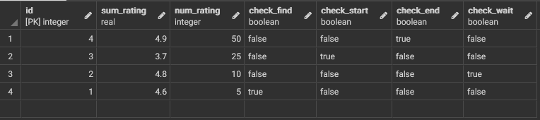

# Проект "Сервис по заказу такси"
Для этого проекта понадобится создать таблицы:

_1. Users - пользователи приложением_

_2. Drivers - водители_

_3. Orders - хранение всех заказов и их состояний на данный момент_

Проект подразумеваею реализацию данных запросов:
1) Пользователь. Отправить заказ

2) Пользователь. Поставить оценку и комментарий

3) Водитель. Поиск заказа

4) Водитель. Выбор заказа, доступно только для водителей с оценкой более 4.8 (заказы, до которых ехать не более 5 минут или ближайший)

5) Водитель. Указать, что прибыл на место_

6) Водитель. Указать, что начал поездку_

7) Водитель. Указать, что поездка закончилась

8) Общее. Произвести расчёт стоимости заказа

9) Администратор. Просмотр статистика по каждому клиенту, сколько
проходит время от приезда водителя на место до отправления

10) Пользователь. Просмотр собственной истории заказов с пагинацией и
поиском по диапазону дат

11) Водитель. Просмотр собственной истории выполненных заказов с
пагинацией и поиском по диапазону дат

## 0) Подготовка таблиц

_Таблица Users_

_Таблица Drivers_

_Таблица Orders_

## 1) Пользователь. Отправить заказ

~~~sql
update users
set check_finding = true
where id = (id пользователя)
~~~

## 2) Пользователь. Поставить оценку и комментарий

~~~sql
update orders
set review = 'Отзыв',
	grade = 'Оценка'
where driever_id = 'Номер водителя' and time_end is not null
~~~

~~~sql
WITH sum_ as (
	SELECT SUM(grade) AS sum_gr,
	count(grade) as cnt
	from orders)
update drivers
set sum_rating = sum_.sum_gr,
	num_rating = sum_.cnt
from sum_
where drivers.id = 'Номер водителя'
~~~

## 3) Водитель. Поиск заказа
~~~sql
update drivers
	set check_find = true,
    check_end = false
where id = 'Номер водителя' and check_find = false

~~~
## 4)Водитель. Выбор заказа, доступно только для водителей с оценкой более 4.8 (заказы, до которых ехать не более 5 минут или ближайший)
Первый запрос:
~~~sql
update drivers 
	set check_find = false
from orders
where orders.driver_id = drivers.id and drivers.id = 'Номер водителя' and (drivers.sum_rating/drivers.num_rating)> 4.8 

~~~
Второй запрос:

~~~sql
update orders 
	set date_finding = localtimestamp
from drivers
where orders.driver_id = drivers.id and drivers.id = 'Номер водителя' and (drivers.sum_rating/drivers.num_rating)> 4.8 '
~~~
Расстояние высчитывается отдельно с помощью систем навигации

## 5)Водитель. Указать, что прибыл на место
Первый запрос:
~~~sql
update drivers 
	set check_wait = true
where drivers.id = 'Номер водителя' and orders.driver_id = drivers.id 

~~~
Второй запрос:

~~~sql
update orders 
	set time_wait = localtimestamp
from drivers
where orders.driver_id = drivers.id and drivers.id = 'Номер водителя' 
~~~

## 6)Водитель. Указать, что начал поездку_
Первый запрос:
~~~sql
update drivers 
	set check_wait = false,
    check_start = true
where drivers.id = 'Номер водителя' and orders.driver_id = drivers.id

~~~
Второй запрос:

~~~sql
update orders 
	set time_start = localtimestamp
from drivers
where orders.driver_id = drivers.id and drivers.id = 'Номер водителя'
~~~

## 7)Водитель. Указать, что поездка закончилась
Первый запрос:
~~~sql
update drivers 
	set check_end = true,
    check_start = false
where drivers.id = 'Номер водителя' and orders.driver_id = drivers.id

~~~
Второй запрос:

~~~sql
update orders 
	set time_end = localtimestamp
from drivers
where orders.driver_id = drivers.id and drivers.id = 'Номер водителя'
~~~
## 8) Произвести расчёт стоимости заказа

~~~sql
WITH sum_ as (
	SELECT extract (minute from (time_end-time_start))*30 as sum_money
from orders
where driver_id = 'Номер водителя')
update orders
set salary = sum_.sum_money	
from sum_
where driver_id = 'Номер водителя'
~~~

## 9)Администратор. Просмотр статистика по каждому клиенту, сколько проходит время от приезда водителя на место до отправления

~~~sql
select us.id, orders.time_start-orders.time_wait
from users us, orders
where us.id=orders.user_id and us.admin = 'admin'
~~~

## 10)Пользователь. Просмотр собственной истории заказов с пагинацией и поиском по диапазону дат

~~~sql
with(
    select extract(day from (localtimestamp - time_end)::interval) as days_
    from orders
)
select driver_id, time_finding, time_wait, time_start, time_end, salary, salary, grade
from users us, orders
where us.id=orders.user_id and salary is not null and us.id = 'Номер пользователя'
and days_< 'Количество дней, которое выберет пользователь' 
~~~

## 11)Водитель. Просмотр собственной истории выполненных заказов с пагинацией и поиском по диапазону дат

~~~sql
with(
    select extract(day from (localtimestamp - time_end)::interval) as days_
    from orders
)
select user_id, time_finding, time_wait, time_start, time_end, salary, salary, grade
from drivers dr, orders
where dr.id = orders.driver_id and salary is not null and us.id = 'Номер пользователя' and days_< 'Количество дней, которое выберет пользователь' 
~~~